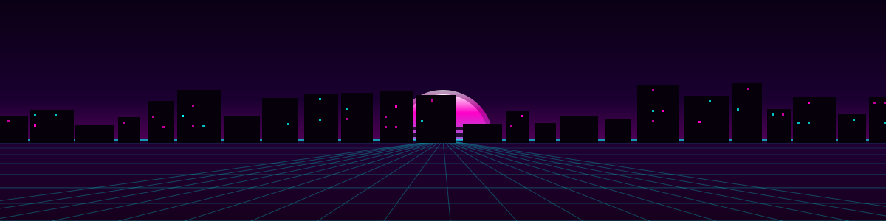
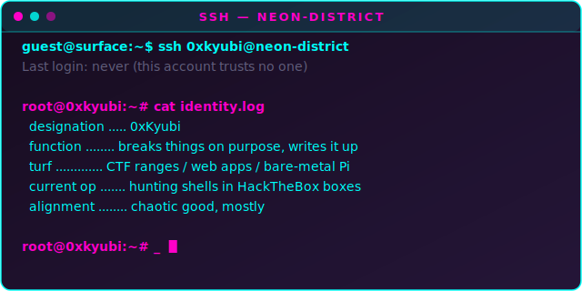
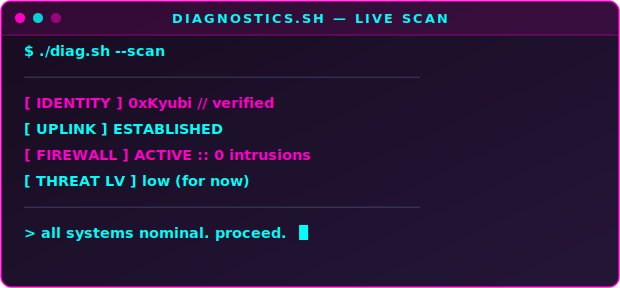
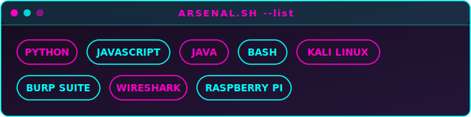
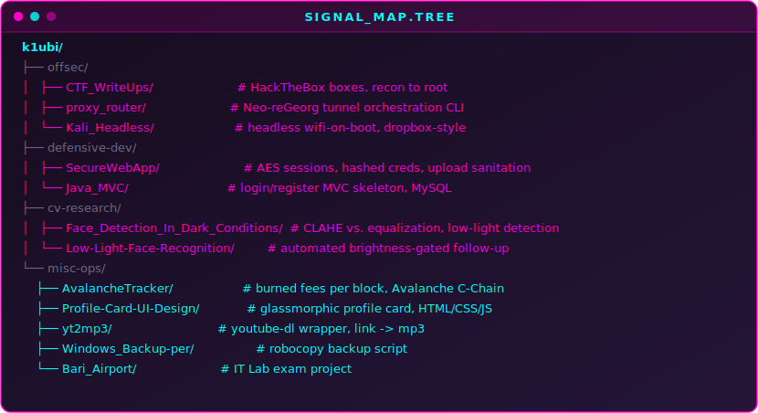

<!-- you inspected the source. respect. there's more of this further down. -->

<div align="center">



```
 _____      _   ____   ___   _______ _____ 
|  _  |    | | / /\ \ / / | | | ___ \_   _|
| |/' |_  _| |/ /  \ V /| | | | |_/ / | |  
|  /| \ \/ /    \   \ / | | | | ___ \ | |  
\ |_/ />  <| |\  \  | | | |_| | |_/ /_| |_ 
 \___//_/\_\_| \_/  \_/  \___/\____/ \___/ 
```

[](#)

</div>

<br>

```
▓▒░ 0x00 // BOOT LOG ░▒▓
```

<div align="center">

</div>

<br>

```
 ___ ___   _   ___ _  _  ___  ___ _____ ___ ___ ___ 
|   \_ _| /_\ / __| \| |/ _ \/ __|_   _|_ _/ __/ __|
| |) | | / _ \ (_ | .` | (_) \__ \ | |  | | (__\__ \
|___/___/_/ \_\___|_|\_|\___/|___/ |_| |___\___|___/
                                                    
```

<div align="center">

</div>

<br>

```
▓▒░ 0x01 // ARSENAL ░▒▓
```

<div align="center">

</div>

<br>

```
▓▒░ 0x02 // TRANSMISSIONS (featured ops) ░▒▓
```

<table>
<tr>
<td width="50%" valign="top">

**[CTF_WriteUps](https://github.com/k1ubi/CTF_WriteUps)**
HackTheBox boxes torn down and documented — recon to root, every pivot logged.

</td>
<td width="50%" valign="top">

**[proxy_router](https://github.com/k1ubi/proxy_router)**
Centralizes Neo-reGeorg tunnels into one manifest with a single CLI to raise, route, and kill them.

</td>
</tr>
<tr>
<td width="50%" valign="top">

**[SecureWebApp](https://github.com/k1ubi/SecureWebApp)**
Java web app built around defensive programming — session handling, hashing, upload sanitation.

</td>
<td width="50%" valign="top">

**[Low-Light-Face-Recognition](https://github.com/k1ubi/Low-Light-Face-Recognition)**
Face recognition tuned for low-light frames via contrast stretching and adaptive equalization.

</td>
</tr>
</table>

<br>

```
   ______________  _____   __     __  ______   ___ 
  / __/  _/ ___/ |/ / _ | / /    /  |/  / _ | / _ \
 _\ \_/ // (_ /    / __ |/ /__  / /|_/ / __ |/ ___/
/___/___/\___/_/|_/_/ |_/____/ /_/  /_/_/ |_/_/    
                                                   
```

<div align="center">

</div>

<br>

```
▓▒░ 0x03 // TELEMETRY ░▒▓
```

<div align="center">

</div>

<br>

```
▓▒░ 0x04 // LIVE SIGNAL ░▒▓
```

<!--START_SECTION:activity-->
1. 🎉 Merged PR [#1](https://github.com/k1ubi/Bari_Airport/pull/1) in [k1ubi/Bari_Airport](https://github.com/k1ubi/Bari_Airport)
2. 🎉 Merged PR [#1](https://github.com/k1ubi/AvalancheTracker/pull/1) in [k1ubi/AvalancheTracker](https://github.com/k1ubi/AvalancheTracker)
3. 🎉 Merged PR [#1](https://github.com/k1ubi/yt2mp3/pull/1) in [k1ubi/yt2mp3](https://github.com/k1ubi/yt2mp3)
4. 🎉 Merged PR [#1](https://github.com/k1ubi/Profile-Card-UI-Design/pull/1) in [k1ubi/Profile-Card-UI-Design](https://github.com/k1ubi/Profile-Card-UI-Design)
5. 🎉 Merged PR [#1](https://github.com/k1ubi/Low-Light-Face-Recognition/pull/1) in [k1ubi/Low-Light-Face-Recognition](https://github.com/k1ubi/Low-Light-Face-Recognition)
<!--END_SECTION:activity-->

<br>

<div align="center">

<pre align="center">
                @.@X   S8.8                
             8X@           S %.            
           X%  @;:8:     .:S  8.           
         ;    :; 88S   S ;S;8   :S         
        @8    :;%;8S   S S..8    S@        
       S8      @;:8: X :8.:S      ;8       
      ;8        t:.X888@.%:        %X      
      X       ;.   %X@8X   t@       :      
     8.      X8     .t;     S8       t     
     .      ;8               t8      t     
    @                         @       8    
    X      S                          8    
    .      %                   X.     8    
   t:     S                     S      ;   
  S:      :                     X       :  
 %%                             @       .8 
 8        %                     X          
 8                              8        .;
X         8                               t
S          X                   .;         t
S          8                   :          t
X    .     :X                 ;@     .    t
 @  S%.     .                 X       X  .;
 8    ;      S.              %      8 S.   
 S:8    :      :           .8     .@   :.@ 
  S     8t     8;.        %@     8S     S  
          ;t     88;8S8t8@     8:.         
            8@t.           .X88            
           ;8t;:tX@@   X8X%:;t@%           
          S8@@@@@@t     8@@@@@@@8          
           SS. .t8.      8t. .%@           
</pre>

> *"The quieter you became, the more you are able to hear."*

</div>

<br>

<details>
<summary>▓▒░ decrypt for classified transmission ░▒▓</summary>
<br>

```
[DECRYPTING...] ██████████████████████████ 100%

log entry #4471:
"the proxy.json in one of my public repos still has psw: examplepsw
in it. yes, I know. no, I'm not fixing it — it's a placeholder,
and also a small tax on anyone who clones the repo without reading
the README first."

log entry #4472:
"asked to secure the planet. currently negotiating with a Raspberry
Pi that reboots itself out of spite."

log entry #4473:
"if you're reading this in the page source instead of on the
rendered page: hi. you're the kind of person this profile was
written for."
```

</details>

<details>
<summary>▓▒░ sudo access request ░▒▓</summary>
<br>

```
$ sudo access --profile=0xKyubi
[sudo] password for guest: ********
guest is not in the sudoers file. This incident will be reported.

(it will not be reported. there is no one to report it to.)
```

</details>

<!-- if you found this, you're the target audience: someone who reads before they clone. -->

<br>

<div align="center">

`.: . . : <[ end of transmission ]> : . :.`


</div>
